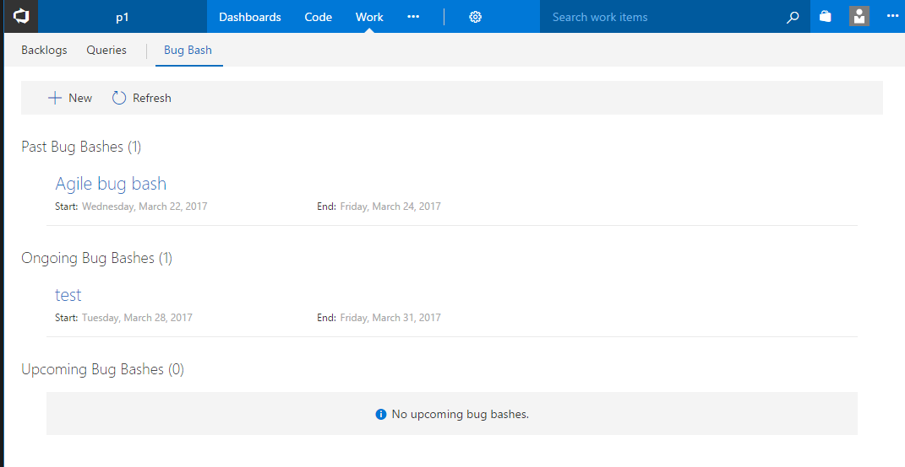
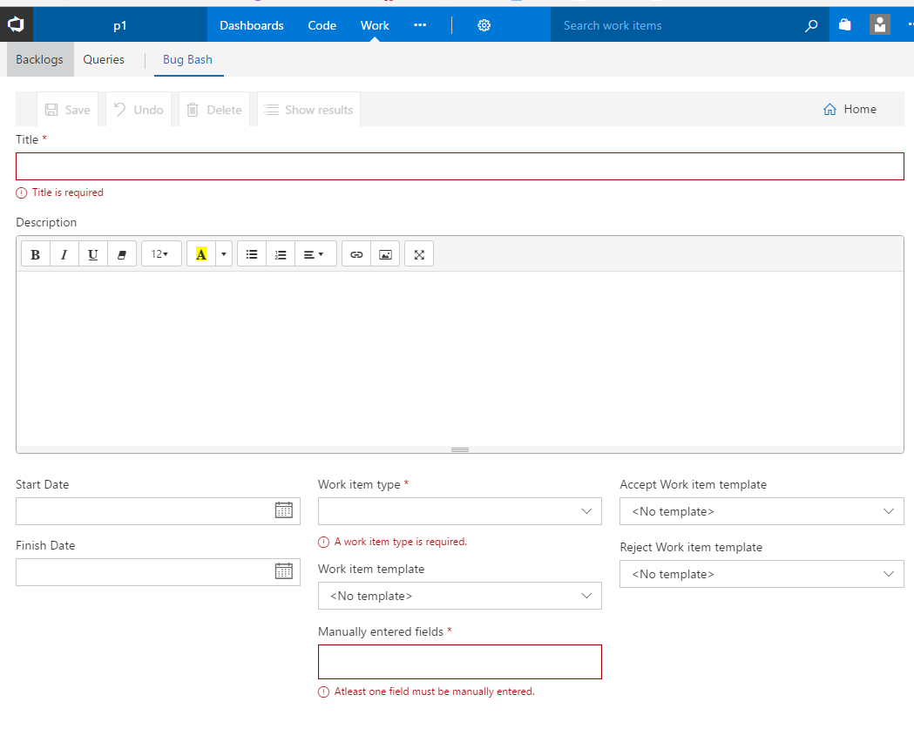
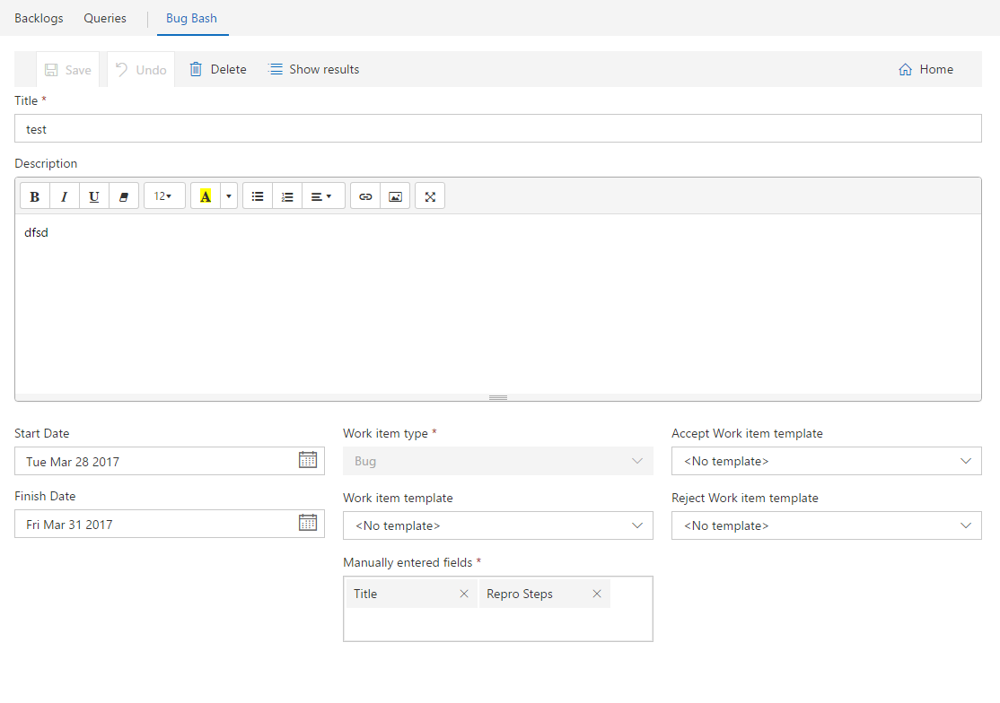
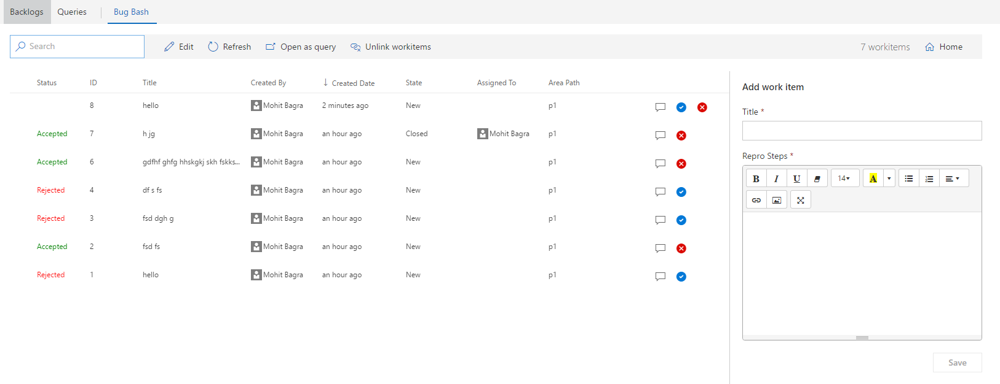

# Manage team wide bug bashes
A work item hub extension that lets teams manage their bug bashes in a more efficient manner. When a new feature is being tested either org wide or team wide, a lots of bugs are created and its hard to track all the bugs created in one instance of testing. Users can use features like work item templates to use pre-defined set of field values while creating bugs and then track them using work item queries, but its a tedious process in 2 ways - 

1. A work item form needs to be opened each time to create a workitem.
2. To track all workitems in the bug bash, you need to navigate to the query view which makes you lose work item form view.

Some teams use tools like OneNote or other note syncing apps where users can track all the workitems and add new workitems in the same page, but then someone has to manually create VSTS workitems from that note.

This extension tries to simplify this in 2 ways -

1. View all the workitems created in a bug bash instance while creating a new workitem.
2. Quickly accept/reject workitems.

#### Overview ####
The home page of the extension shows all the past/ongoing/upcoming bug bash instances. 

To create a new bug bash instance, click "New", which opens the bug bash editor

You can enter bug bash information in the editor to create it. Here are the properties of a bug bash instances -

1. **Title** *(required)* - The title of the bug bash instance
2. **Description** - A short description about the bug bash. It can describe what the bug bash is for. What features need to be tested etc.
3. **Start Date** - A start date for the bug bash. This is not a required field. An empty start date means the bug bash is ongoing until it ends.
4. **End Date** - An end date for the bug bash. This is not a required field. An empty end date means the bug bash never ends.
5. **Work item type** *(required)* - Describes which type of workitem this bug bash instance associates with. 
6. **Work item template** - You can choose a work item template that would be used to autofill certain field values for each new workitem created in this bug bash instance. A work item template can be created from VSTS team admin view. Note that work item templates are team scoped, so in this dropdown, you can only choose templates which are in the scope of the current team.
7. **Manually entered fields** *(required)* - Pick a set of fields which the users need to fill while creating workitems in this instance of bug bash.
8. **Accept Workitem template** - Select which template should be applied to a workitem when a user accepts it in the bug bash's results view. 
9. **Reject Workitem template** - Select which template should be applied to a workitem when a user rejects it in the bug bash's results view. 

*P.S.* : Work item templates are defined per team per workitem type. So the templates in the dropdowns would be scoped to the current team and the workitem type selected from WorkItemType dropdown. Since the templates are team scoped, each bug bash instance is also scoped to a team. So the bug bash instance created in the context of team "t1" would not show up in the bug bash view in team "t2".

Once saved, click on "Show Results" to go to the results view of this bug bash instance.

In the results view, users can view all the workitems created in this bug bash instance and also users can create new workitems in this bug bash. The workitems are associated with a particular bug bash instance via work item tags. If a workitem has a tag - "BugBash\_123", then it falls under the bug bash which has id 123. The bug bash id is of type "long int". When a new workitem is created from the right panel in this view, the workitem is created by using the user entered field values (Title and Repro steps in this case) and the work item template selected during bug bash creation. And then to associate the workitem with this instance of bug bash, a work item tag "BugBash_123" is added to the workitem.
To accept a workitem, click on blue arrow button, to reject a workitem click on red cross button. When a workitem(s) is accepted, it applies the "Accept work item template" to the workitem (if its specified in the bug bash) and then adds a tag "BugBashItemAccepted" to the workitem to mark it as accepted in the bug bash. When a workitem(s) is rejected, it applies the "Reject work item template" to the workitem (if its specified in the bug bash) and then adds a tag "BugBashItemRejected" to the workitem to mark it as accepted in the bug bash. 

**Other Operations**
1. *Open as Query* - Opens selected (or all) workitems as a VSTS query. 
2. *Unlink workitems* - Unlinks selected (or all) workitems from this bug bash instance. By unlinking, I mean that it will remove the "BugBash_123", "BugBashItemAccepted" and "BugBashItemRejected" tags from the workitems which breaks the link between the workitem and a bug bash instance.

*P.S* - Each work item row in the results view also has a context menu. So users can right click on a row (or on multiple selected rows) to open the context menu.

#### Future plans ####
1. Investigate "Auto refresh" feature in the results view.
2. Add a "Merge" action in workitem row's context menu which merges duplicate workitems into one.